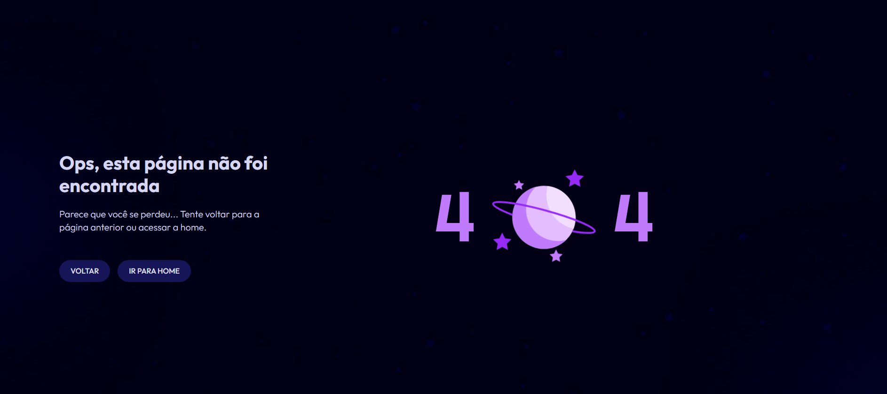

# Desafio 27: #boraCodar uma página 404

Esse é o bora codar numero 27 desafio Semanal da Rocketseat, codando uma  tela de Pagina não encontrada com uma animação bem interesante em LottieFiles

👉🏼[Link do projeto](https://bora-codar-pagina-404.netlify.app/)

#  💻🔧 Tecnologias

- HTML
- CSS
- Responsividade mobile first
- Git
- Git Hub

## Contato 💻

juniorjose1925@gmail.com

https://www.linkedin.com/in/jose-martinez-352032222/
